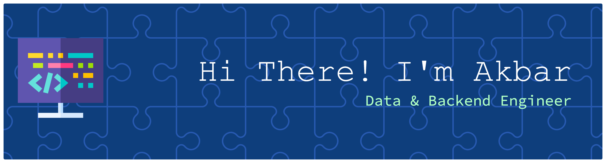

  

  <b>Data & Backend Engineer • Streaming • ETL • APIs</b> 
  I build data-intensive systems and backend services — from real-time pipelines and ETL workflows to REST APIs and analytics backends.

---

<h2 align="left">About me</h2>

  • I enjoy turning messy, real-world data into clean, reliable pipelines and APIs. 
  • I care about performance, reliability, observability, and maintainable architecture. 
  • I like working end-to-end: ingestion, storage, modeling, serving, and deployment.

---

<h3 align="left">Toolbox</h3>

  <!-- Languages -->
  

   

  <!-- Backend -->
  
  

   

  <!-- Databases -->
  
  

   

  <!-- Data Engineering -->
  
  

   

  <!-- DevOps -->
  
  
  
  

---

<h2 align="left">What I do</h2>

<ul align="left">
  <li><b>Data Engineering</b>: Designing and building ETL/ELT pipelines, streaming jobs (Kafka / Spark), and data models for analytics and dashboards.</li>
  <li><b>Backend Engineering</b>: Developing RESTful services with Python/FastAPI/Flask and Java/Spring Boot/Quarkus, integrated with relational databases and ORMs.</li>
  <li><b>DevOps & CI/CD</b>: Containerizing services with Docker and automating build, test, and deploy workflows using CircleCI and GitHub Actions.</li>
</ul>

---

<h2 align="left">Recent focus</h2>

<ul align="left">
  <li>Building a real-time e-commerce analytics platform using Kafka, Spark Structured Streaming, FastAPI, Spring Boot, PostgreSQL, and Grafana.</li>
  <li>Developing an end-to-end ETL pipeline with Python, Playwright, BeautifulSoup, Luigi, Docker, and PostgreSQL.</li>
  <li>Designing CI/CD workflows for containerized web applications with safe migrations, health checks, and rollback logic.</li>
</ul>

---

<h2 align="left">GitHub Stats</h2>

  
  

---

<h2 align="left">Featured work</h2>

Explore my pinned repositories for selected projects and experiments: 
streaming analytics, ETL pipelines, REST APIs, and automation scripts. 
I'm always happy to discuss trade-offs, architecture decisions, and implementation details.

---

<h2 align="left">Get in touch</h2>

   
   
  

---

<h2 align="">LET'S PLAY !!! </h2>

<picture>
  <source media="(prefers-color-scheme: dark)" srcset="https://raw.githubusercontent.com/CodeSavesMe/CodeSavesMe/output/pacman-contribution-graph-dark.svg">
  <source media="(prefers-color-scheme: light)" srcset="https://raw.githubusercontent.com/CodeSavesMe/CodeSavesMe/output/pacman-contribution-graph.svg">
  
</picture>
